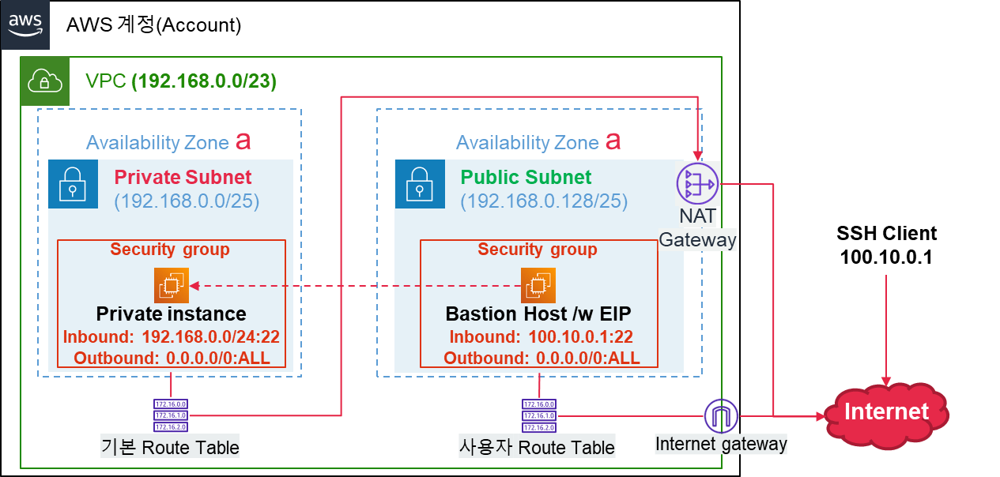
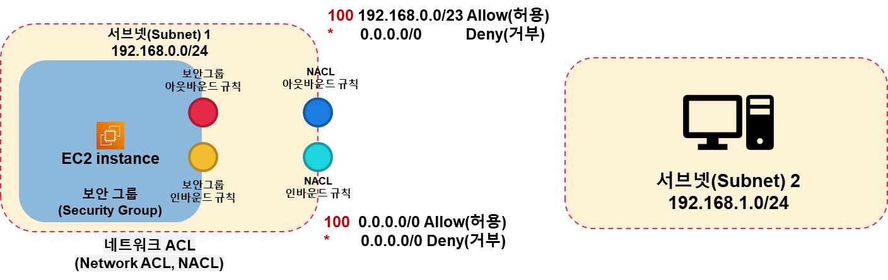

# AWS 기말고사 총정리
## 복습 퀴즈
### 9주차
1. 다음 라우팅 테이블에 대한 설명 중 틀린 것을 모두 고르시오.<br>
하나 이상을 선택하세요.
   1. VPC를 생성할 때 기본 라우팅 테이블이 자동 생성된다.
   2. 기본 라우팅 테이블을 삭제할 수 있다.
   3. 라우팅 규칙 간에 IP 범위가 서로 겹치는 경우 중 가장 좁은 범위의 IP CIDR 블록이 가장 우선순위가 높다.
   4. 라우팅 테이블은 서브넷 별로 다르게 설정할 수 있다.
   5. VPC 내의 서브넷 간에 통신을 위해서는 라우팅 테이블 생성 후 새로운 규칙을 별도로 추가해야 한다.
   - 해설<br>
   기본 라우팅 테이블은 삭제할 수 없습니다.<br>
   하나의 VPC 내부에 있는 모든 서브넷 간에 통신을 기본적으로 허용하기 위해서 라우팅 테이블에는 VPC 대역에 대한 규칙이 자동으로 생성됩니다.
   - 정답<br>
   기본 라우팅 테이블을 삭제할 수 있다. VPC 내의 서브넷 간에 통신을 위해서는 라우팅 테이블 생성 후 새로운 규칙을 별도로 추가해야 한다.
<br>

2. 다음 중 용어에 대한 설명이 적절한 것을 선택하시오.
   1. 라우팅 테이블에 인터넷 게이트웨이와 연결된 규칙이 존재하는 서브넷
   2. 라우팅 테이블에 인터넷 게이트웨이와 연결된 규칙이 존재하지 않는 서브넷
   - 해설<br>
   퍼블릭 서브넷(Public Subnet)과 프라이빗 서브넷(Private Subnet)<br>
   퍼블릭 서브넷이란?<br>
   라우팅 테이블을 통해 인터넷 게이트웨이와 연결된 서브넷<br>
   프라이빗 서브넷이란?<br>
   인터넷 게이트웨이와 연결되지 않은 서브넷 즉, 인터넷을 통해 외부에서 접근이 불가능한 서브넷<br>
   - 정답<br>
   라우팅 테이블에 인터넷 게이트웨이와 연결된 규칙이 존재하는 서브넷 → 퍼블릭 서브넷, 라우팅 테이블에 인터넷 게이트웨이와 연결된 규칙이 존재하지 않는 서브넷 → 프라이빗 서브넷
<br>

3. 프라이빗 서브넷에 위치한 EC2 인스턴스에 인터넷을 통해 VPC 외부에서 접근하려고 할 때 사용하는 EC2 인스턴스를 가리키는 용어는 무엇인가?
   - 해설<br>
   Bastion Host<br>
   외부에서 접근 가능한 EC2 인스턴스로서, 내부 네트워크에 위치한 서버에 접속하기 위한 접속 전용 호스트
   서비스 운영은 하지 않고, 작업을 위한 용도로 사용
   - 정답<br>
   Bastion Host
<br>

4. 프라이빗 서브넷에 위치한 EC2 인스턴스에서 인터넷에 연결된 컴퓨터와 통신하기 위해서 필요한 리소스는 무엇인가?
   - 해설<br>
   NAT Gateway를 이용한 프라이빗 서브넷에서의 인터넷 접근
     - 프라이빗 서브넷에서 인터넷으로 접근 가능
     - 인터넷에서 NAT를 통해 내부로 접근 불가능
   - 정답<br>
   NAT Gateway
<br>

5. 다음 설명 중 잘못된 것을 모두 고르시오.<br>
하나 이상을 선택하세요.
   1. NAT Gateway는 프라이빗 서브넷에 생성해야한다.
   2. 인터넷에 위치한 장치에서 NAT Gateway를 통해 프라이빗 서브넷의 EC2 인스턴스에 접근할 수 있다.
   3. NAT Gateway는 Public IP를 가져야 한다.
   4. NAT Gateway를 사용하기 위해서는 Internet Gateway가 있어야 한다.
   5. NAT Gateway로 트래픽을 전달하기 위해서는 라우팅 테이블에 규칙을 등록해야 한다.
   - 정답<br>
   NAT Gateway는 프라이빗 서브넷에 생성해야한다.<br>인터넷에 위치한 장치에서 NAT Gateway를 통해 프라이빗 서브넷의 EC2 인스턴스에 접근할 수 있다.
<br>

### 10주차
1. 다음과 같은 네트워크 구성이 있다. 이에 대한 설명 중 잘못된 것을 모두 고르시오.

하나 이상을 선택하세요.
   1. Bastion host에서 Private Instance로 SSH를 통한 접속은 불가능하다
   2. 100.10.0.1 IP를 갖는 서버에서 SSH를 통해 Bastion Host에 접속이 가능하다.
   3. Bastion Host에서 10.0.0.1 IP를 갖는 인터넷에 연결된 장치에 요청을 보낼 경우 정상적으로 통신이 불가능하다.
   4. Private Instance에서 10.0.0.1 IP를 갖는 인터넷에 연결된 장치에 요청을 보낼 경우 정상적으로 통신이 가능하다.
   5. 100.10.0.1 IP를 갖는 장치에서 Private Instance로 SSH를 통해 직접 접속하는 것은 불가능하다.
   - 해설<br>
   192.168.0.0/24는 위의 두 서브넷의 범위를 모두 포함하므로, 두 서브넷에 존재하는 EC2 인스턴스에서 SSH를 통해 Private Instance와 항상 통신이 가능하다.<br>
   보안 그룹은 아웃 바운드 통신이 허용될 경우, 외부로 보낸 요청에 대한 응답을 받는 것은 인바운드 규칙과 무관하게 허용된다.
   - 정답<br>
   Bastion host에서 Private Instance로 SSH를 통한 접속은 불가능하다, Bastion Host에서 10.0.0.1 IP를 갖는 인터넷에 연결된 장치에 요청을 보낼 경우 정상적으로 통신이 불가능하다.
<br>

2. 하나의 보안 그룹을 여러 개의 EC2 인스턴스에서 사용하는 것이 가능하다.<br>
하나를 선택하세요.<br>
(참, 거짓)
   - 해설<br>
   보안 그룹은 하나의 리소스이며, 네트워크 접근을 허용하는 규칙으로 구성되어 있다.<br>
   이러한 보안그룹은 여러 EC2 인스턴스에서 재사용이 가능하다.
   - 정답<br>
   참
<br>

3. 다음과 같은 보안그룹이 설정된 EC2 인스턴스가 있다.
```
Inbound : 192.168.124.0/22 모든 트래픽에 대해서 허용

Outbound : 0.0.0.0/0 모든 트래픽에 대해서 허용
```
다음 중 이 EC2 인스턴스에 접근 할 수 없는 장치를 모두 고르시오.<br>
하나 이상을 선택하세요.
   1. 192.168.124.1
   2. 192.168.125.35
   3. 192.168.126.82
   4. 192.168.127.22
   5. 192.168.128.0
   - 해설<br>
   192.168.124.0/22의 범위는 <br>
   192.168.124.0 ~ 192.168.127.255 에 해당한다.
   - 정답<br>
   192.168.128.0
<br>

### 11주차
1. 다음 NACL에 대한 설명 중 잘못된 것을 모두 고르시오.<br>
하나 이상을 선택하세요.
   1. 서브넷에 대한 트래픽을 제어하는데 사용된다.
   2. 보안그룹과 NACL 중 한 가지만 적용할 수 있다.
   3. 서브넷에 NACL을 연결하지 않아도 된다.
   4. NACL의 아웃바운드 규칙에서 허용된 요청에 대한 응답은 인바운드 규칙에서도 반드시 허용되어야 통신이 가능하다.
   5. 규칙번호가 낮을수록 우선순위가 높다.
   - 해설<br>
   보안그룹은 EC2 인스턴스에, NACL은 서브넷에 적용되어 서로에 대한 영향 없이 독립적으로 사용가능하다.<br>
   모든 서브넷은 반드시 NACL에 연결되어야 한다.
   - 정답<br>
   보안그룹과 NACL 중 한 가지만 적용할 수 있다., 서브넷에 NACL을 연결하지 않아도 된다.
<br>

2. 아래와 같이 NACL이 설정되어 있다. <br>
서브넷 1의 EC2 인스턴스에서 서브넷 2의 EC2 인스턴스로 요청을 보냈을 때, 정상적으로 통신이 되는가? <br>
단, 서브넷2에서 NACL은 인바운드/아웃바운드 모두 모든 포트에 대해 0.0.0.0/0에 대한 트래픽을 허용한다.<br>
서브넷1과 2의 보안그룹에서 인바운드/아웃바운드 모두 모든 포트에 대해 0.0.0.0/0 대역에 대한 트래픽을 허용한다.

하나를 선택하세요.<br>
(참, 거짓)
   - 해설<br>
   192.168.0.0/23은 192.168.0.0/24와 192.168.1.0/24를 모두 포함하므로 통신이 가능하다.
   - 정답<br>
   참
<br>

3. RDS를 사용할 때, 고가용성을 확보하기 위한 기능을 무엇이라 하는가?<br>
   - 해설<br>
   Multi-AZ 혹은 다중 AZ
   - 정답<br>
   Multi AZ
<br>

### 12 ~ 13 주차
1. LAMP를 이루는 구성요소 4가지는 무엇의 약자인가? (소문자로 작성)
   - 정답<br>
   Linux<br>
   Apache<br>
   MySQL<br>
   PHP<br>
<br>

2. Linux에서 시작 프로그램을 관리하기 위한 systemd를 관리하기 위한 명령줄 도구의 이름은?
   - 정답<br>
   systemctl
<br>

3. 네트워크 트래픽을 하나 이상의 서버나 장비로 분산하기 위해 사용되는 기술을 무엇이라 하는가?<br>
   - 해설<br>
   
   - 정답<br>
   load balancing
<br>

4. **웹 트래픽 증가에 대응하기 위한 방법 2 가지의 명칭을 작성하고, <br>
2 가지 방법의 차이점이 무엇인지 간단히 작성하시오.<br>**
   - 정답<br>
   웹 트래픽 증가에 따른 대응 방법<br>
   1. Scale Up<br>
       - CPU/RAM/Disk 성능/Network 대역폭 등 증가
       - 비싸고 성능 좋은 서버로 변경
   2. Scale Out (로드 밸런싱과 함께 활용)
       - 부하를 처리할 서버 대수를 늘림
       - 저렴한 서버 여러 대를 이용해 더 많은 부하를 감당
<br>

5. **ALB는 OSI 7 Layer 중 어느 계층의 정보를 이용해 로드 밸런싱을 수행하는가?**<br>
   - 해설<br>
   ALB(Application Load Balancer)<br>
   OSI 7 Layer 중 Application Layer에 속하는 패킷을 처리할 수 있음<br>
   HTTP/HTTPS 프로토콜<br>
   - 정답<br>
   Application
<br>
