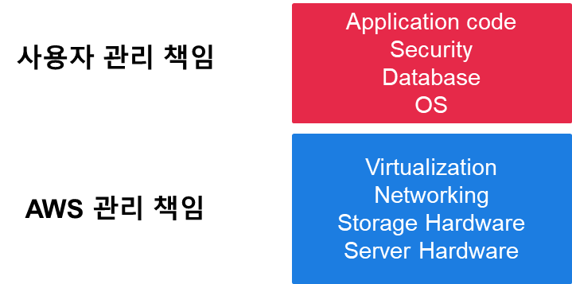

## week 3
### 문제 1
다음 중 전통적인 IT 서비스를 구성하는 요소가 아닌 것을 고르시오.
1. IT 인프라
2. 인터넷과 연결된 네트워크 환경
3. 서비스용 SW
4. 데이터 센터
5. 가상 머신

### 문제 2
클라우드 환경을 통해 IT 서비스를 개발하고 운영하려는 경우 서버를 대여하기 위한 초기 비용이 크게 발생한다.
<br>
참,거짓

### 문제 3
전통적인 IT 서비스 구축 과정의 어려움을 두 가지 관점에서 간략히 설명하세요.

### 문제 4
데이터 센터가 필요한 이유를 간략히 설명하시오.

### 문제 5
클라우드 환경에서 IT 서비스를 구축 및 운영할 때의 장점을 두 가지를 간략히 설명하시오.

### 문제 6
클라우드 환경에서 IT 서비스를 구축할 때, 사용자 규모 예측이 필요 없는 이유는 무엇 때문인가?

## week 3 답안
1. 가상머신
2. 거짓
3. 서술형 답안
   1. 장비 구매와 데이터 센터 임차 등을 수행하는데 기간이 오래 걸릴 수 있다.
   2. 장비 구매 등으로 인해 초기에 큰 비용이 발생할 수 있다.

5. 서술형 답안
   - IT 서비스를 24시간/7일 내내 안정적으로 운영하기 위해 IT 인프라에 대한 안정적인 전력 공급, 온도 및 습도 관리, 인터넷과 네트워크 연결을 제공해줌
6. 서술형 답안
   1. 낮은 초기 비용과 구매 기간 단축
   2. 사용자 규모 예측 불필요
7. 서술형 답안
   - 사용자 규모가 증가하는 경우 즉시, 필요한 만큼 자원을 추가로 대여하는 확장성과 사용자 규모가 줄어드는 경우 즉시, 반납할 수 있는 탄력성을 제공하기 때문

## week 4
### 문제 1
리눅스 터미널에서 현재 위치한 디렉토리를 확인하는 명령어는?

### 문제 2
현재 위치한 디렉토리에 있는 파일들의 목록과 하위 디렉토리 목록을 출력하기 위한 명령어는?<br>
단, 숨겨진 파일 및 디렉토리 목록과 세부 정보를 모두 출력해야 함

### 문제 3
리눅스의 디렉토리 구조에서 상대경로와 절대경로를 설명하세요

### 문제 4
리눅스 터미널에서 ~ 기호의 의미를 설명하세요

### 문제 5
다음과 같은 디렉토리 구조가 있다.<br>
현재 위치한 디렉토리는 /home/ec2-user 디렉토리일 때,<br>
test 디렉토리를 삭제하기 위한 명령어를 작성하세요.<br>


## week 4 답안
1. pwd
2. ls -al
3. 서술형 답안
   1. 상대 경로
   - 현재 디렉토리를 기준으로 경로를 명시
   2. 절대 경로
   - 현재 디렉토리와 상관없이 전체 경로를 모드 명시

4. 서술형 답안
- 리눅스에서 틸드(~) 기호는 사용자 디렉토리를 나타내는데 사용

1. 서술형 답안
```console
$ rm -r test (상대경로)
$ rm -r /home/ec2-user/test (절대경로)
```

## week 5
### 문제 1
다음과 같은 관리 책임을 갖는 유형의 클라우드 플랫폼 모델을 무엇이라 하는가?<br>


### 문제 2
AMI에 대해서 간략히 설명하시오.
### 문제 3
다음 중 EC2 인스턴스의 성능을 결정하는 요소가 아닌 것은?
1. vCPU
2. Memory
3. Storage
4. Network
5. AMI
### 문제 4
인스턴스 스토어와 EBS의 차이점을 설명하시오.
### 문제 5
리눅스 touch 명령어의 동작 방식을 설명하시오.

## week 5 답안
1. IaaS(Infrastructure as a Service)
2. 서술형 답안
- OS와 애플리케이션의 묶음(Package)을 의미하며, 파일 형태로 되어있다.
- AMI를 사용해서 EC2 인스턴스에서 사용할 OS와 애플리케이션을 선택할 수 있다.
- 실행 중인 EC2 인스턴스의 현재 상태를 Custom AMI로 생성할 수 있고, 이를 이용해서 EC2 인스턴스를 생성할 수 있어 클라우드의 확장성을 구현하는데 사용된다.

3. AMI
4. 서술형 답안
- EBS는 데이터 영구 보관 가능, 인스턴스 스토어는 중지(Stop) 후 시작 시 데이터 삭제
- EBS는 물리 디스크에 문제가 발생하더라도 복구 가능, 인스턴스 스토어는 복구 불가
- EBS는 데이터 암호화 가능, 인스턴스 스토어는 불가
- EBS는 스토리지의 용량과 성능을 늘리고 줄이는 것이 가능, 인스턴스 스토어는 불가

5. 서술형 답안
- touch 명령어의 인자는 파일명이 되며,파일이 존재하지 않을 경우 빈 파일을 새로 생성하고, 기존에 파일이 존재할 경우 파일의 수정 시간을 현재 시간으로 업데이트 한다.

## week 6
### 문제 1
수직확장(Scale-Up)과 수평확장(Scale-Out)에 대해서 간단히 설명하시오.

### 문제 2
EC2 인스턴스의 사용자 데이터는 항상 인스턴스 초기 생성 시점에 한 번만 실행되고, 그 이후로 실행시킬 수 있는 방법은 없다.
<br>
참,거짓

### 문제 3
Linux 리다이렉션에서 '>>'와 '>'의 차이점에 대해서 간단히 설명하시오.

### 문제 4
AWS에서 리소스를 구분하기 위한 유일한 식별자 역할을 하는 것을 무엇이라 하는가?

### 문제 5
IAM 역할과 IAM 사용자의 차이점에 대해서 간략히 설명하시오

## week 6 답안
1. 서술형 답안
- 수직확장은 서버의 성능에 관여하는 CPU,Memory,Network,Storage 등을 더 높은 사양으로 업그레이드하여 사용자 부하에 대응하는 것을 의미한다.
- 수평확장은 서버의 개수를 늘려 사용자 부하에 대응하는 것을 의미한다.

2. 거짓
   - 해설
   - 스크립트를 통해 사용자 데이터가 매번 부팅 시점마다 실행되게 만들 수 있다.

3. 서술형 답안
- `>>` : 파일이 존재할 경우 내용을 다음 줄(Line)에 추가
- `>` : 파일이 존재할 경우 덮어쓰기(Overwrite)

4. ARN
   - 해설
   - ARN(Amazon Resource Name)
   - 리소스를 구분하기 위한 유일한 식별자(Unique Identifier)

5. 서술형 답안
- IAM 사용자는 실제 사용자를 구분하고, 사용자 별로 할 수 있는 일을 구분하기 위해 사용되는 개체
- IAM 역할은 AWS 서비스나 리소스 그 자체에 권한을 부여하는 방법

## week 7
### 문제 1
IP 주소(IP Address)를 비트(Bit)로 변환해 보세요
1. 10.0.0.1
2. 192.168.10.1
3. 255.255.255.0

### 문제 2
비트(Bit)를 IP 주소(IP Address)로 변환해 보세요
1. 11111000 01011000 00010000 00000011
2. 11111110 00000100 01011100 00001010

### 문제 3
다음 주소가 가질 수 있는 IP 주소의 범위와 사용가능한 IP 개수를 계산하시오.
1. 192.168.0.0/28
2. 192.168.0.0/26
3. 232.12.0.0/16

### 문제 4
196.0.10.0/24 주소 범위를 갖는 네트워크를 2 개의 서브넷으로 분할해서 각 서브넷 네트워크 주소 범위를 IP CIDR 블록으로 나타내시오.

### 문제 5
196.0.10.0/23 주소 범위를 갖는 네트워크를 3 개의 서브넷으로 분할해서 각 서브넷 네트워크 주소 범위를 IP CIDR 블록으로 나타내시오. 각 서브넷의 크기(주소 범위의 크기)는 다를 수 있다. 반드시 네트워크의 모든 IP 범위가 각 서브넷에서 사용되어야 한다.

## week 7 답안
1. 답안
   1. 00001010.00000000.00000000.00000001
   2. 11000000.10101000.00001010.00000001
   3. 11111111.11111111.11111111.00000000

2. 답안
   1. 248.88.16.3
   2. 254.4.92.10

3. 답안
   1. 192.168.0.0 ~ 192.168.0.15, 16개
   2. 192.168.0.0 ~ 192.168.0.63, 64개
   3. 232.12.0.0 ~ 232.12.0.255, 2^16개

4. 답안
   - 196.0.10.0/25
   - 196.0.10.128/25

1. 답안
   - 196.0.10.0/24
   - 196.0.11.0/25
   - 196.0.11.128/25